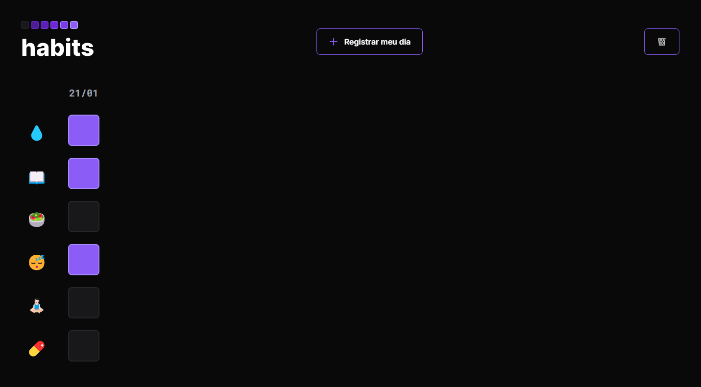

## NLW Setup - Habits

Habits é um *habit tracker* desenvolvido durante o evento NLW, promovido pela Rocketseat.

___

### Como funciona?
*Habit trackers* são utilizados para acompanhar diariamente a realização de atividades cotidianas importantes como beber água, estudar, ler, tomar remédios - qualquer hábito que uma pessoa deseja cultivar em sua rotina pode ser acompanhado por um tracker. Nesse modelo, o tracker registra as tarefas: __beber água, estudar, ter uma alimentação saudável, sono regulado, meditar/relaxar e tomar remédios__.

O usuário registra o dia através do botão __"+ Registrar meu dia"__ e seleciona quais atividades realizou naquele dia.

Os dados são armazenados localmente. Caso deseje excluir o histórico do mês ou começar novamente o acompanhamento de hábitos sem as informações do passado, basta selecionar o botão __"🗑️"__.

___

### Tecnologias utilizadas

  

